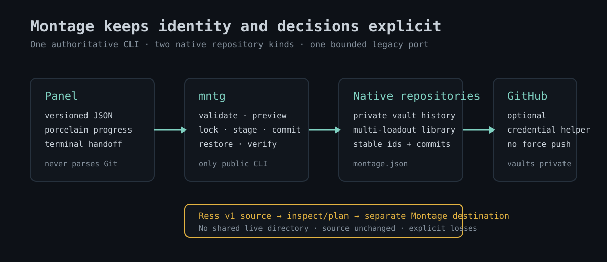

<h1 align="center">Montage</h1>

<p align="center"><strong>Capture the reconstructible shape of an Omarchy machine, restore it safely, and share deliberate loadouts.</strong></p>

Montage records packages, selected configuration, themes, web apps, plugins,
services, and optional encrypted secrets in local Git repositories. It previews
before mutation, preserves replaced files, keeps privilege and execution consent
visible, and exposes versioned CLI output for the panel and automation.

Montage is an independent project derived from Ress. It has its own plugin id,
command, XDG state, repository formats, release metadata, and roadmap. Ress v1
artifacts cross the boundary only through explicit import/export commands;
Montage and Ress never share live state.



## Install

```bash
omarchy plugin add https://github.com/tombychowski/omarchy-montage --enable
~/.config/omarchy/plugins/tombychowski.montage/bin/mntg link
mntg doctor
```

`mntg link` creates only `~/.local/bin/mntg`. It never replaces an unrelated
path and never installs `ress` or `montage` (the latter may belong to
ImageMagick).

## Start a private vault

```bash
mntg init
mntg repository configure laptop "$HOME/.local/share/montage/vault" vault \
  --remote git@github.com:you/private-omarchy-vault.git
mntg backup
mntg backup list
```

A vault can include personal configuration, host evidence, and encrypted-secret
ciphertext. Keep its remote private. Montage warns before configuring a remote
that GitHub reports as public.

Restore one immutable backup by commit or label:

```bash
mntg backup show before-reinstall
mntg restore --backup before-reinstall
mntg verify --backup before-reinstall
```

Restore is additive and resumable. Existing files are kept with a
`.montage-bak` suffix before replacement. AUR builds and enabling user services
remain separate consent decisions; `--yes` does not answer them.

## Maintain a loadout library

One repository may hold multiple stable loadouts:

```bash
mntg repository init loadouts "$HOME/.local/share/montage/loadouts" --id personal-library
mntg repository configure personal "$HOME/.local/share/montage/loadouts" loadouts \
  --remote https://github.com/you/omarchy-loadouts.git
mntg repository loadouts personal
```

Portable leaves remain schema-version-1 `profile.json` documents with
`kind: "omarchy-loadout"`. Montage-specific identity and history live in the
repository-level `montage.json`, so a leaf remains constrained and portable.

Create or update one selected item:

```bash
mntg share --repository personal --loadout minimal
mntg share catalog --repository personal --loadout minimal --json
mntg repository sync personal --push
```

Apply one exact repository item:

```bash
mntg apply https://github.com/you/omarchy-loadouts.git --loadout minimal --dry-run
mntg apply https://github.com/you/omarchy-loadouts.git --loadout minimal
mntg loadout check
```

A loadout can represent packages, pinned plugins, reconstructible web apps, and
one theme. It has no command, attachment, dotfile, arbitrary-file, secret, or
cleanup-authority field.

## Synchronize deliberately

```bash
mntg repository sync personal          # fetch and classify
mntg repository sync personal --pull   # fast-forward only
mntg repository sync personal --push   # ordinary push only
```

Montage never force-pushes, resets divergent history, or invents a merge. A
divergent result requires an explicit user decision outside the preview.

## Port Ress v1 artifacts

Do not point Montage at live Ress directories. Inspect and convert a copy into
a separate destination:

```bash
mntg port ress inspect /path/to/ress-vault --json
mntg port ress plan /path/to/ress-vault \
  --destination "$HOME/.local/share/montage/imported-vault" --json
mntg port ress import vault /path/to/ress-vault \
  --destination "$HOME/.local/share/montage/imported-vault"
```

Current-snapshot import is the default. Optional history translation validates
each Ress revision independently and creates new Montage commits; it never
claims legacy hashes or remotes as native history. Export similarly writes a
separate disposable Ress v1 copy and requires itemized loss acceptance.

See [Port Ress v1 artifacts](docs/workflows/ress-portability.md) and the
[migration guide](docs/workflows/migrate-from-ress.md).

## Panel

The `tombychowski.montage` bar widget has four keyboard-accessible tabs:

- **Backup** — freshness, categories, scheduling, and consent policy;
- **Repositories** — native repository selection, loadout library, immutable
  backup history, sync previews, settings, retention, and Ress porting;
- **Share** — selective composition of the chosen repository loadout; and
- **Loadouts** — desired state already tracked on this machine.

The panel invokes only `mntg`. It does not parse Git or repository artifacts.
Restore, retention, synchronization decisions, loadout mutation, and port
publication open in a terminal so preview, confirmation, privilege, and AUR
consent remain visible.

See [Panel principles](docs/panel/principles.md),
[keyboard workflow](docs/panel/keyboard-workflow.md), and
[status language](docs/panel/status-language.md).

## What travels

| Category | Representation | Restore behavior |
|---|---|---|
| Packages | explicit native and AUR names | installs only missing packages; AUR is separately gated |
| Dotfiles | curated `$HOME` paths | preserves replaced files as `*.montage-bak` |
| Omarchy | selected themes, hooks, and settings | validates contained paths and supported shapes |
| Web apps | reconstructible launcher fields | recreates through supported Omarchy tooling |
| Plugins | id, sanitized remote, pinned commit | validates identity and commit before use |
| Services | declarative user-unit inventory | enabling is separately gated |
| Secrets | opt-in age-encrypted archive | never falls back to plaintext |

Montage is not a backup for documents, photos, repositories, databases, disks,
or hardware configuration. Use a real data-backup system for those.

## Safety model

- No arbitrary scripts or command fields in loadouts.
- No URL credentials in repositories, profiles, catalogs, or applied state.
- No deletion inferred from absence.
- No cleanup authority imported from Ress.
- No symlink traversal or escaping repository readers.
- No mutation from malformed, unsupported, or future schema versions.
- No private age identity in a vault or port artifact.
- No panel-side interpretation of repository or machine state.

The exact contracts live under [docs/contracts](docs/index.md#work-with-exact-interfaces).

## Encrypted secrets

Secrets are disabled by default:

```bash
sudo pacman -S age
mntg secrets init
mntg secrets add .ssh/id_example
mntg secrets enable
mntg backup
```

Passphrase mode prompts interactively. Recipient mode keeps the private identity
outside the vault and transfers it through a separate secure channel. See
[Transport encrypted secrets](docs/workflows/encrypted-secrets.md).

## Command map

```text
mntg backup [--message TEXT] [--push] [--secrets]
mntg backup <list|show|label|unlabel|retain> ...
mntg restore [--from URL] [--backup COMMIT] [--only LIST] [--skip LIST]
mntg verify [--backup COMMIT] [--json]

mntg repository <init|list|show|validate|configure|remove|loadouts|loadout|sync> ...
mntg share --repository NAME --loadout ID ...
mntg apply REPOSITORY --loadout ID [--dry-run]
mntg loadout <list|show|check|repair|update|remove> ...
mntg resource <list|show> ...

mntg port ress <inspect|plan|import|export> ...
mntg status [--json]
mntg scan [--json]
mntg diff [--stock]
mntg set KEY=VALUE
mntg secrets <init|list|add|enable|disable>
mntg doctor
mntg link [--remove]
```

Run `mntg --help` for exact options. JSON commands return one versioned object;
`--porcelain` streams the documented operation protocol.

## Configuration and state

Montage owns only its namespaced roots:

- `~/.config/montage/` — settings, include/exclude lists, secret configuration;
- `~/.local/share/montage/` — default native repositories and exported data;
- `~/.local/state/montage/` — locks, progress, findings, and applied state; and
- `~/.cache/montage/` — disposable caches.

Repository locations may be configured elsewhere, but must be absolute,
validated native repositories. The panel and CLI do not offer shared live Ress
paths.

## Update and remove

```bash
omarchy plugin update tombychowski.montage

mntg link --remove
omarchy plugin remove tombychowski.montage
```

Removing the plugin does not remove user-owned repositories or Montage XDG
state. Review and remove those separately only when you no longer need them.
The Ress plugin, its `ress` command, and its data are never changed.

## Development and verification

```bash
git clone https://github.com/tombychowski/omarchy-montage
cd omarchy-montage
./tests/run.sh
openspec validate --all --strict
```

The CLI entrypoint is `bin/mntg`; sourced modules live under `lib/montage/`.
See the [documentation index](docs/index.md), [testing strategy](docs/testing/strategy.md),
and [fresh-machine checklist](docs/testing/fresh-machine-validation.md).

MIT licensed. Ress is a separate project and trademark/name belonging to its
respective maintainers; Montage interoperability is limited to the documented
Ress v1 port boundary.
